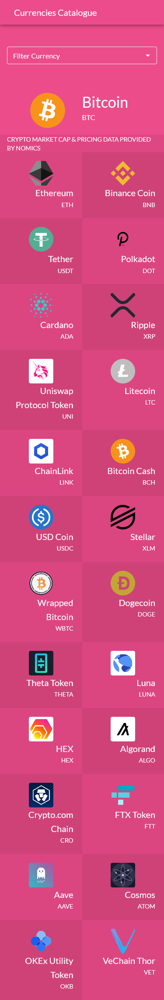

# Currencies Catalogue

> A React Redux application that fetches an API and list the top 25 available CryptoCurrencies.


<p align="center">Desktop view</p>



<p>Mobile view</p>

<p>Additional description about the project and its features.</p>

## Built With

- ReactJS
- Redux
- Redux thunk
- Material UI

## Tested With

- Jest
- Enzyme
- redux-mock-store
- moxios

## Live Demo

[Live Demo Link](https://currencies-catalogue.netlify.app)


## Getting Started


To get a local copy up and running follow these simple example steps.

### Prerequisites

- NodeJS
- Code Editor

### Setup

Open up a terminal (after installing Git) and run the following command:

```
  git clone https://github.com/martinnajjar12/currencies-catalogue
```

and hit Enter.

**OR**

Download a zip version of the project from the above button.

### Install

Run in your command line:

```
  npm install
```

### Usage

In order to open it in your browser, you need to dispatch the following command:

```
  npm start
```

**Note:** Please be noted that API may not work on your local computer because you don't have the API KEY.

### Run tests

To test the application please run this command:

```
  npm test
```

## Authors

👤 **Martin Najjar**

- GitHub: [Martin Najjar](https://github.com/martinnajjar12)
- Twitter: [Martin Najjar](https://twitter.com/martin_najjar)
- LinkedIn: [Martin Najjar](https://linkedin.com/in/martinnajjar12)

## 🤝 Contributing

Contributions, issues, and feature requests are welcome!

Feel free to check the [issues page](https://github.com/martinnajjar12/currencies-catalogue/issues).

## Show your support

Give a ⭐️ if you like this project!

## Acknowledgments

- [Nomics](https://nomics.com) for providing the API
- Design by [Nelson Sakwa](https://www.behance.net/sakwadesignstudio)
- Microverse

## 📝 License

This project is [MIT](https://github.com/martinnajjar12/currencies-catalogue/blob/development/LICENSE) licensed.